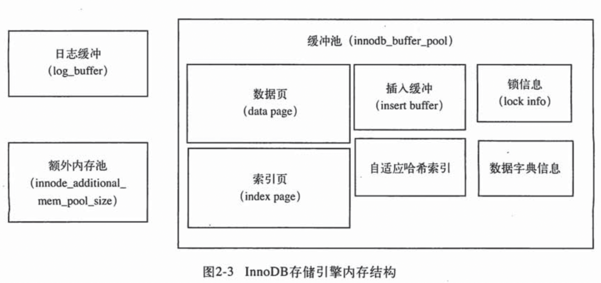

# MySQL Innodb 存储引擎深入学习
[toc]
## 概念

## 命令
### 查看引擎前段时间的状态
`show engine innodb status\G;`
~~~
*************************** 1. row ***************************
  Type: InnoDB
  Name:
Status:
=====================================
2022-04-23 21:03:35 0x16ee0f000 INNODB MONITOR OUTPUT
=====================================
Per second averages calculated from the last 41 seconds
-----------------
BACKGROUND THREAD
-----------------
srv_master_thread loops: 1 srv_active, 0 srv_shutdown, 2812 srv_idle
srv_master_thread log flush and writes: 0
----------
SEMAPHORES
----------
OS WAIT ARRAY INFO: reservation count 3
OS WAIT ARRAY INFO: signal count 3
RW-shared spins 0, rounds 0, OS waits 0
RW-excl spins 0, rounds 0, OS waits 0
RW-sx spins 0, rounds 0, OS waits 0
Spin rounds per wait: 0.00 RW-shared, 0.00 RW-excl, 0.00 RW-sx
------------
TRANSACTIONS
------------
Trx id counter 2823
Purge done for trx's n:o < 2821 undo n:o < 0 state: running but idle
History list length 0
LIST OF TRANSACTIONS FOR EACH SESSION:
---TRANSACTION 281479956860032, not started
0 lock struct(s), heap size 1128, 0 row lock(s)
---TRANSACTION 281479956859240, not started
0 lock struct(s), heap size 1128, 0 row lock(s)
---TRANSACTION 281479956858448, not started
0 lock struct(s), heap size 1128, 0 row lock(s)
--------
FILE I/O
--------
I/O thread 0 state: waiting for i/o request (insert buffer thread)
I/O thread 1 state: waiting for i/o request (log thread)
I/O thread 2 state: waiting for i/o request (read thread)
I/O thread 3 state: waiting for i/o request (read thread)
I/O thread 4 state: waiting for i/o request (read thread)
I/O thread 5 state: waiting for i/o request (read thread)
I/O thread 6 state: waiting for i/o request (write thread)
I/O thread 7 state: waiting for i/o request (write thread)
I/O thread 8 state: waiting for i/o request (write thread)
I/O thread 9 state: waiting for i/o request (write thread)
Pending normal aio reads: [0, 0, 0, 0] , aio writes: [0, 0, 0, 0] ,
 ibuf aio reads:, log i/o's:, sync i/o's:
Pending flushes (fsync) log: 0; buffer pool: 0
1349 OS file reads, 226 OS file writes, 53 OS fsyncs
0.00 reads/s, 0 avg bytes/read, 0.00 writes/s, 0.00 fsyncs/s
-------------------------------------
INSERT BUFFER AND ADAPTIVE HASH INDEX
-------------------------------------
Ibuf: size 1, free list len 0, seg size 2, 0 merges
merged operations:
 insert 0, delete mark 0, delete 0
discarded operations:
 insert 0, delete mark 0, delete 0
Hash table size 34679, node heap has 0 buffer(s)
Hash table size 34679, node heap has 0 buffer(s)
Hash table size 34679, node heap has 0 buffer(s)
Hash table size 34679, node heap has 0 buffer(s)
Hash table size 34679, node heap has 0 buffer(s)
Hash table size 34679, node heap has 0 buffer(s)
Hash table size 34679, node heap has 1 buffer(s)
Hash table size 34679, node heap has 3 buffer(s)
0.00 hash searches/s, 0.00 non-hash searches/s
---
LOG
---
Log sequence number          18220080
Log buffer assigned up to    18220080
Log buffer completed up to   18220080
Log written up to            18220080
Log flushed up to            18220080
Added dirty pages up to      18220080
Pages flushed up to          18220080
Last checkpoint at           18220080
14 log i/o's done, 0.00 log i/o's/second
----------------------
BUFFER POOL AND MEMORY
----------------------
Total large memory allocated 0
Dictionary memory allocated 354903
Buffer pool size   8191
Free buffers       7245
Database pages     942
Old database pages 367
Modified db pages  0
Pending reads      0
Pending writes: LRU 0, flush list 0, single page 0
Pages made young 0, not young 0
0.00 youngs/s, 0.00 non-youngs/s
Pages read 800, created 142, written 161
0.00 reads/s, 0.00 creates/s, 0.00 writes/s
No buffer pool page gets since the last printout
Pages read ahead 0.00/s, evicted without access 0.00/s, Random read ahead 0.00/s
LRU len: 942, unzip_LRU len: 0
I/O sum[0]:cur[0], unzip sum[0]:cur[0]
--------------
ROW OPERATIONS
--------------
0 queries inside InnoDB, 0 queries in queue
0 read views open inside InnoDB
Process ID=689, Main thread ID=0x16e1c3000 , state=sleeping
Number of rows inserted 0, updated 0, deleted 0, read 0
0.00 inserts/s, 0.00 updates/s, 0.00 deletes/s, 0.00 reads/s
Number of system rows inserted 0, updated 315, deleted 0, read 4633
0.00 inserts/s, 0.00 updates/s, 0.00 deletes/s, 0.00 reads/s
----------------------------
END OF INNODB MONITOR OUTPUT
============================

1 row in set (0.01 sec)

ERROR:
No query specified
~~~

### 查看Innodb版本
`show variables like 'innodb_version';`
~~~
+----------------+--------+
| Variable_name  | Value  |
+----------------+--------+
| innodb_version | 8.0.28 |
+----------------+--------+
~~~

### 查看缓冲池大小
`show variables like 'innodb_buffer_pool_size';`
~~~
+-------------------------+-----------+
| Variable_name           | Value     |
+-------------------------+-----------+
| innodb_buffer_pool_size | 134217728 |
+-------------------------+-----------+
~~~
### 查看重做日志缓冲池大小
`show variables like 'innodb_log_buffer_size';`
~~~
+------------------------+----------+
| Variable_name          | Value    |
+------------------------+----------+
| innodb_log_buffer_size | 16777216 |
+------------------------+----------+
~~~
