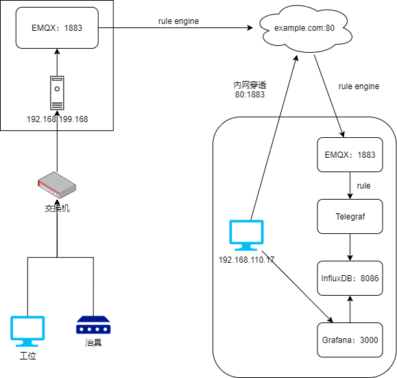

# 物联网实时监控数据指标方案

## 背景

- 希望实时监控物联网设备数据指标并进行可视化分析
- 希望跨局域网条件下依然能获取到数据
- 希望持久化设备数据分析用户行为

## 设计思路

### 交互协议

#### 工厂 EMQ Rule Engine

~~~
SQL:
    SELECT
      topic as topic,
      nth(3, tokens(topic,'/')) as sn,
      json_decode(payload.data) as data,
      data.Lidar2D as Lidar2D
    FROM
      "/dev/jig/+/event/post"
    WHERE
      is_null(Lidar2D)

Action Handler:
    Type: data_to_mqtt_broker
    payload_tmpl: { "sn": "${sn}", "data": ${data} }
    forward_topic: ${topic}
    Resource: resource:761060(须新建resource资源指向公网域名)
~~~

#### 本地 EMQ Rule Engine

~~~
SQL:
    SELECT
      nth(3, tokens(topic,'/')) as sn,
      payload.data as data,
      data.Lidar2D as Lidar2D
    FROM
      "/dev/jig/+/event/post"
    WHERE
      is_null(Lidar2D)

Action Handler:
    Type: republish
    target_topic: /robot/event/monitor
    target_qos: 0
    payload_tmpl: { "sn": "${sn}", "data": ${data} }
~~~

#### Telegraf Rule

~~~
[[inputs.mqtt_consumer]]
  servers = ["tcp://localhost:1883"]
  topics = [
    "/robot/event/monitor"
  ]
  username = "telegraf"
  password = "12345678"

  data_format = "json_v2"
  [[inputs.mqtt_consumer.json_v2]]
      measurement_name = "robot_consumer"
      #timestamp_path = "timestamp"
      #timestamp_format = "unix_ms"
      [[inputs.mqtt_consumer.json_v2.object]]
          path = "@this"
          tags = ["sn"]
          disable_prepend_keys = true
[[inputs.mqtt_consumer]]
  servers = ["tcp://localhost:1883"]
  topics = [
    "/jig/event/monitor"
  ]
  username = "telegraf"
  password = "12345678"

  data_format = "json_v2"
  [[inputs.mqtt_consumer.json_v2]]
      measurement_name = "jig_consumer"
      #timestamp_path = "timestamp"
      #timestamp_format = "unix_ms"
      [[inputs.mqtt_consumer.json_v2.object]]
          path = "@this"
          tags = ["sn"]
          disable_prepend_keys = true
~~~

## 技术实现

**OS：Ubuntu 20.04**

**服务启动顺序**：InfluxDB --> EMQX --> Telegraf --> Grafana

### EMQ

#### 介绍

EMQX (Erlang/Enterprise/Elastic MQTT Broker) 是基于 Erlang/OTP 平台开发的开源物联网 MQTT 消息服务器。

Erlang/OTP是出色的软实时 (Soft-Realtime)、低延时 (Low-Latency)、分布式 (Distributed)的语言平台。

MQTT 是轻量的 (Lightweight)、发布订阅模式 (PubSub) 的物联网消息协议。

EMQX 设计目标是实现高可靠，并支持承载海量物联网终端的 MQTT 连接，支持在海量物联网设备间低延时消息路由:

- 稳定承载大规模的 MQTT 客户端连接，单服务器节点支持 200 万连接。
- 分布式节点集群，快速低延时的消息路由。
- 消息服务器内扩展，支持定制多种认证方式、高效存储消息到后端数据库。
- 完整物联网协议支持，MQTT、MQTT-SN、CoAP、LwM2M、WebSocket 或私有协议支持。

#### 安装

参考文档：[https://www.emqx.io/docs/zh/v4.4/getting-started/install.html]()

~~~Shell
wget https://github.com/emqx/emqx/releases/download/v4.4.3/emqx-edge-4.4.3-otp24.1.5-3-ubuntu20.04-amd64.deb
sudo apt install ./emqx-edge-4.4.3-otp24.1.5-3-ubuntu20.04-amd64.deb
sudo service emqx start
sudo service emqx status
~~~

### InfluxDB

#### 介绍

InfluxDB 是一个时间序列数据库(TSDB), 被设计用来处理高写入、高查询负载，是 TICK 的一部分。

TSDB 是针对时间戳或时间序列数据进行优化的数据库，专门为处理带有时间戳的度量和事件或度量而构建的。

而时间序列数据可以是随时间跟踪、监视、下采样和聚合的度量或事件，如服务器指标、应用程序性能、网络数据、传感器数据以及许多其他类型的分析数据。

使用 InfluxDB 以更少的代码为分析、物联网和云原生服务构建实时应用程序。

#### 应用场景

- 定制DevOps监控(Custom DevOps Monitoring)
- 实时分析(Real Time Analytics)
- 物联网和传感器数据(IoT and Sensor Data)
- 云计算(Cloud & OpenStack)
- 异常检测(Anomaly Detection)
- 消息(Messaging)
- 个性化(Personalization)
- 股票交易(Equities Trading)
- 市政基础设施管理(Municipal Infrastructure Management)
- GPS服务(GPS Services)
- 量子物理研究(Quantum Physics Research)
- POS系统(Point of Sale Systems)
- 制造业和家庭自动化(Manufacturing & Home Automation)
- 运输和物流(Transportation & Material Logistics)

#### 安装

参考文档：

[https://docs.influxdata.com/influxdb/v2.2/install/]()

[https://github.com/influxdata/influxdb]()

~~~Shell
# 安装InfluxDB
wget https://dl.influxdata.com/influxdb/releases/influxdb2-2.2.0-amd64.deb
sudo dpkg -i influxdb2-2.2.0-amd64.deb
sudo service influxdb start
sudo service influxdb status

#安装Influx Cli及初始化InfluxDB
wget https://dl.influxdata.com/influxdb/releases/influxdb2-client-2.3.0-linux-amd64.tar.gz
tar zxvf influxdb2-client-2.3.0-linux-amd64.tar.gz
sudo cp influxdb2-client-2.3.0-linux-amd64/influx /usr/local/bin/
influx setup \
 --username ldrobot \
 --password 12345678 \
 --org example.org \
 --bucket RealTimeMonitor \
 --retention 168 \
 --token 2tn6qFEZ8RsIWvjspjG4FGFXPHlkf_xkEOcLJZWchlNdnnYxADjIJBf_gsSdWlJqPNJg3HvoLnViHG8068vELg== \
 --force
~~~

### Telegraf

#### 介绍

Telegraf 是一个插件驱动的服务器代理，用于收集和报告指标，是 TICK 堆栈的第一部分。 Telegraf 有插件可以直接从其运行的系统中获取各种指标，从第三方 API 中提取指标，甚至通过 statsd 和 Kafka
消费者服务来监听指标。 它还具有输出插件，可将指标发送到各种其他数据存储、服务和消息队列，包括 InfluxDB、Graphite、OpenTSDB、Datadog、Librato、Kafka、MQTT、NSQ 等。

#### 安装

参考文档：[https://docs.influxdata.com/telegraf/v1.22/install/]()

~~~Shell
wget -qO- https://repos.influxdata.com/influxdb.key | sudo tee /etc/apt/trusted.gpg.d/influxdb.asc >/dev/null
echo "deb https://repos.influxdata.com/debian stable main" | sudo tee /etc/apt/sources.list.d/influxdb.list
sudo apt-get update && sudo apt-get install telegraf

sudo cat <<EOF > /etc/telegraf/telegraf.conf
[agent]
  interval = "10s"

  round_interval = true
  metric_batch_size = 1000

  metric_buffer_limit = 10000
  collection_jitter = "0s"
  flush_interval = "10s"
  flush_jitter = "0s"
  precision = ""

  debug = false
  hostname = ""
  omit_hostname = true
###############################################################################
#                            OUTPUT PLUGINS                                   #
###############################################################################
 [[outputs.influxdb_v2]]
  urls = ["http://localhost:8086"]
  token = "2tn6qFEZ8RsIWvjspjG4FGFXPHlkf_xkEOcLJZWchlNdnnYxADjIJBf_gsSdWlJqPNJg3HvoLnViHG8068vELg=="
  organization = "example.org"
  bucket = "RealTimeMonitor"
###############################################################################
#                            INPUT PLUGINS                                    #
###############################################################################
[[inputs.mqtt_consumer]]
  servers = ["tcp://localhost:1883"]
  topics = [
    "/robot/event/monitor"
  ]
  username = "telegraf"
  password = "12345678"

  data_format = "json_v2"
  [[inputs.mqtt_consumer.json_v2]]
      measurement_name = "robot_consumer"
      #timestamp_path = "timestamp"
      #timestamp_format = "unix_ms"
      [[inputs.mqtt_consumer.json_v2.object]]
          path = "@this"
          tags = ["sn"]
          disable_prepend_keys = true
[[inputs.mqtt_consumer]]
  servers = ["tcp://localhost:1883"]
  topics = [
    "/jig/event/monitor"
  ]
  username = "telegraf"
  password = "12345678"

  data_format = "json_v2"
  [[inputs.mqtt_consumer.json_v2]]
      measurement_name = "jig_consumer"
      #timestamp_path = "timestamp"
      #timestamp_format = "unix_ms"
      [[inputs.mqtt_consumer.json_v2.object]]
          path = "@this"
          tags = ["sn"]
          disable_prepend_keys = true
EOF

sudo service telegraf restart
sudo service telegraf status
~~~

### Grafana

#### 介绍

Grafana 是一个完整的可观察性堆栈，允许您监控和分析指标、日志和跟踪。它允许您查询，可视化，警报和理解您的数据，无论数据存储在何处。

#### 示例

##### EMQ数据监控

##### System数据监控

#### 安装

[https://grafana.com/docs/grafana/latest/]()

~~~Shell
sudo apt-get install -y apt-transport-https
sudo apt-get install -y software-properties-common wget
wget -q -O - https://packages.grafana.com/gpg.key | sudo apt-key add -
echo "deb https://packages.grafana.com/enterprise/deb stable main" | sudo tee -a /etc/apt/sources.list.d/grafana.list
sudo apt-get update
sudo apt-get install grafana-enterprise -y
sudo service grafana-server start
sudo service grafana-server status
~~~

#### 扫地机状态面板

**_须替换数据源influxdb的uid为实际面板添加的数据源uid_**

~~~
{
  "annotations": {
    "list": [
      {
        "builtIn": 1,
        "datasource": "-- Grafana --",
        "enable": true,
        "hide": true,
        "iconColor": "rgba(0, 211, 255, 1)",
        "name": "Annotations & Alerts",
        "target": {
          "limit": 100,
          "matchAny": false,
          "tags": [],
          "type": "dashboard"
        },
        "type": "dashboard"
      }
    ]
  },
  "editable": true,
  "fiscalYearStartMonth": 0,
  "graphTooltip": 0,
  "id": 1,
  "iteration": 1652777153196,
  "links": [],
  "liveNow": false,
  "panels": [
    {
      "collapsed": false,
      "gridPos": {
        "h": 1,
        "w": 24,
        "x": 0,
        "y": 0
      },
      "id": 42,
      "panels": [],
      "title": "主板治具联调类",
      "type": "row"
    },
    {
      "fieldConfig": {
        "defaults": {
          "color": {
            "mode": "palette-classic"
          },
          "custom": {
            "axisLabel": "",
            "axisPlacement": "auto",
            "barAlignment": 0,
            "drawStyle": "line",
            "fillOpacity": 0,
            "gradientMode": "none",
            "hideFrom": {
              "legend": false,
              "tooltip": false,
              "viz": false
            },
            "lineInterpolation": "linear",
            "lineWidth": 1,
            "pointSize": 5,
            "scaleDistribution": {
              "type": "linear"
            },
            "showPoints": "auto",
            "spanNulls": false,
            "stacking": {
              "group": "A",
              "mode": "none"
            },
            "thresholdsStyle": {
              "mode": "off"
            }
          },
          "mappings": [],
          "thresholds": {
            "mode": "absolute",
            "steps": [
              {
                "color": "green",
                "value": null
              },
              {
                "color": "red",
                "value": 80
              }
            ]
          }
        },
        "overrides": []
      },
      "gridPos": {
        "h": 8,
        "w": 8,
        "x": 0,
        "y": 1
      },
      "id": 40,
      "options": {
        "legend": {
          "calcs": [],
          "displayMode": "list",
          "placement": "bottom"
        },
        "tooltip": {
          "mode": "single"
        }
      },
      "targets": [
        {
          "datasource": {
            "type": "influxdb",
            "uid": "mC-ZYfL7z"
          },
          "query": "t1 = from(bucket: \"${BucketName}\")\r\n  |> range(start: v.timeRangeStart, stop: v.timeRangeStop)\r\n  |> filter(fn: (r) => r[\"sn\"] == \"${JIG_SN}\")\r\n  |> filter(fn: (r) => r[\"_field\"] == \"DI6\")\r\n\r\n  |> drop(columns: [\"topic\", \"_measurement\", \"sn\"])\r\n\r\nt2 = from(bucket: \"${BucketName}\")\r\n  |> range(start: v.timeRangeStart, stop: v.timeRangeStop)\r\n  |> filter(fn: (r) => r[\"sn\"] == \"${SN}\")\r\n  |> filter(fn: (r) => r[\"_field\"] == \"PoleConnectStatus\")\r\n\r\n  |> drop(columns: [\"topic\", \"_measurement\", \"sn\"])\r\n\r\nunion(tables: [t1, t2])",
          "refId": "A"
        }
      ],
      "title": "集尘解码设备",
      "type": "timeseries"
    },
    {
      "fieldConfig": {
        "defaults": {
          "color": {
            "mode": "palette-classic"
          },
          "custom": {
            "axisLabel": "",
            "axisPlacement": "auto",
            "barAlignment": 0,
            "drawStyle": "line",
            "fillOpacity": 0,
            "gradientMode": "none",
            "hideFrom": {
              "legend": false,
              "tooltip": false,
              "viz": false
            },
            "lineInterpolation": "linear",
            "lineWidth": 1,
            "pointSize": 5,
            "scaleDistribution": {
              "type": "linear"
            },
            "showPoints": "auto",
            "spanNulls": false,
            "stacking": {
              "group": "A",
              "mode": "none"
            },
            "thresholdsStyle": {
              "mode": "off"
            }
          },
          "mappings": [],
          "thresholds": {
            "mode": "absolute",
            "steps": [
              {
                "color": "green",
                "value": null
              },
              {
                "color": "red",
                "value": 80
              }
            ]
          }
        },
        "overrides": [
          {
            "__systemRef": "hideSeriesFrom",
            "matcher": {
              "id": "byNames",
              "options": {
                "mode": "exclude",
                "names": [
                  "BatteryLevel"
                ],
                "prefix": "All except:",
                "readOnly": true
              }
            },
            "properties": [
              {
                "id": "custom.hideFrom",
                "value": {
                  "legend": false,
                  "tooltip": false,
                  "viz": true
                }
              }
            ]
          }
        ]
      },
      "gridPos": {
        "h": 8,
        "w": 8,
        "x": 8,
        "y": 1
      },
      "id": 32,
      "options": {
        "legend": {
          "calcs": [],
          "displayMode": "list",
          "placement": "bottom"
        },
        "tooltip": {
          "mode": "single"
        }
      },
      "targets": [
        {
          "datasource": {
            "type": "influxdb",
            "uid": "mC-ZYfL7z"
          },
          "query": "t1 = from(bucket: \"${BucketName}\")\r\n  |> range(start: v.timeRangeStart, stop: v.timeRangeStop)\r\n  |> filter(fn: (r) => r[\"sn\"] == \"${JIG_SN}\")\r\n  |> filter(fn: (r) => r[\"_field\"] == \"AI1\" or r[\"_field\"] == \"AI2\" or r[\"_field\"] == \"EAI1\")\r\n\r\n  |> drop(columns: [\"topic\", \"_measurement\", \"sn\"])\r\n\r\nt2 = from(bucket: \"${BucketName}\")\r\n  |> range(start: v.timeRangeStart, stop: v.timeRangeStop)\r\n  |> filter(fn: (r) => r[\"sn\"] == \"${SN}\")\r\n  |> filter(fn: (r) => r[\"_field\"] == \"BatteryLevel\")\r\n\r\n  |> drop(columns: [\"topic\", \"_measurement\", \"sn\"])\r\n\r\nunion(tables: [t1, t2])",
          "refId": "A"
        }
      ],
      "title": "电池设备组",
      "type": "timeseries"
    },
    {
      "fieldConfig": {
        "defaults": {
          "color": {
            "mode": "palette-classic"
          },
          "custom": {
            "axisLabel": "",
            "axisPlacement": "auto",
            "barAlignment": 0,
            "drawStyle": "line",
            "fillOpacity": 0,
            "gradientMode": "none",
            "hideFrom": {
              "legend": false,
              "tooltip": false,
              "viz": false
            },
            "lineInterpolation": "linear",
            "lineWidth": 1,
            "pointSize": 5,
            "scaleDistribution": {
              "type": "linear"
            },
            "showPoints": "auto",
            "spanNulls": false,
            "stacking": {
              "group": "A",
              "mode": "none"
            },
            "thresholdsStyle": {
              "mode": "off"
            }
          },
          "mappings": [],
          "thresholds": {
            "mode": "absolute",
            "steps": [
              {
                "color": "green",
                "value": null
              },
              {
                "color": "red",
                "value": 80
              }
            ]
          }
        },
        "overrides": [
          {
            "__systemRef": "hideSeriesFrom",
            "matcher": {
              "id": "byNames",
              "options": {
                "mode": "exclude",
                "names": [
                  "MopStatus"
                ],
                "prefix": "All except:",
                "readOnly": true
              }
            },
            "properties": [
              {
                "id": "custom.hideFrom",
                "value": {
                  "legend": false,
                  "tooltip": false,
                  "viz": true
                }
              }
            ]
          }
        ]
      },
      "gridPos": {
        "h": 8,
        "w": 8,
        "x": 16,
        "y": 1
      },
      "id": 34,
      "options": {
        "legend": {
          "calcs": [],
          "displayMode": "list",
          "placement": "bottom"
        },
        "tooltip": {
          "mode": "single"
        }
      },
      "targets": [
        {
          "datasource": {
            "type": "influxdb",
            "uid": "mC-ZYfL7z"
          },
          "query": "from(bucket: \"${BucketName}\")\r\n  |> range(start: v.timeRangeStart, stop: v.timeRangeStop)\r\n  |> filter(fn: (r) => r[\"sn\"] == \"${SN}\")\r\n  |> filter(fn: (r) => r[\"_field\"] == \"LeftPickUp\" or r[\"_field\"] == \"RightPickUp\" or r[\"_field\"] == \"DustBoxStatus\" or r[\"_field\"] == \"CollisionLeft\" or r[\"_field\"] == \"CollisionRight\" or r[\"_field\"] == \"MopStatus\" or r[\"_field\"] == \"FindChargeButton\")\r\n\r\n  |> drop(columns: [\"topic\", \"_measurement\", \"sn\"])",
          "refId": "A"
        }
      ],
      "title": "按键设备组",
      "type": "timeseries"
    },
    {
      "fieldConfig": {
        "defaults": {
          "color": {
            "mode": "palette-classic"
          },
          "custom": {
            "axisLabel": "",
            "axisPlacement": "auto",
            "barAlignment": 0,
            "drawStyle": "line",
            "fillOpacity": 0,
            "gradientMode": "none",
            "hideFrom": {
              "legend": false,
              "tooltip": false,
              "viz": false
            },
            "lineInterpolation": "linear",
            "lineWidth": 1,
            "pointSize": 5,
            "scaleDistribution": {
              "type": "linear"
            },
            "showPoints": "auto",
            "spanNulls": false,
            "stacking": {
              "group": "A",
              "mode": "none"
            },
            "thresholdsStyle": {
              "mode": "off"
            }
          },
          "mappings": [],
          "thresholds": {
            "mode": "absolute",
            "steps": [
              {
                "color": "green",
                "value": null
              },
              {
                "color": "red",
                "value": 80
              }
            ]
          }
        },
        "overrides": []
      },
      "gridPos": {
        "h": 8,
        "w": 8,
        "x": 0,
        "y": 9
      },
      "id": 38,
      "options": {
        "legend": {
          "calcs": [],
          "displayMode": "list",
          "placement": "bottom"
        },
        "tooltip": {
          "mode": "single"
        }
      },
      "targets": [
        {
          "datasource": {
            "type": "influxdb",
            "uid": "mC-ZYfL7z"
          },
          "query": "from(bucket: \"${BucketName}\")\r\n  |> range(start: v.timeRangeStart, stop: v.timeRangeStop)\r\n  |> filter(fn: (r) => r[\"sn\"] == \"${SN}\")\r\n  |> filter(fn: (r) => r[\"_field\"] == \"IrLeft\" or r[\"_field\"] == \"IrRight\" or r[\"_field\"] == \"IrFrontRight\" or r[\"_field\"] == \"IrFrontLeft\" or r[\"_field\"] == \"IrBackRight\" or r[\"_field\"] == \"IrBackLeft\")\r\n\r\n  |> drop(columns: [\"topic\", \"_measurement\", \"sn\"])",
          "refId": "A"
        }
      ],
      "title": "红外解码设备组",
      "type": "timeseries"
    },
    {
      "fieldConfig": {
        "defaults": {
          "color": {
            "mode": "palette-classic"
          },
          "custom": {
            "axisLabel": "",
            "axisPlacement": "auto",
            "barAlignment": 0,
            "drawStyle": "line",
            "fillOpacity": 0,
            "gradientMode": "none",
            "hideFrom": {
              "legend": false,
              "tooltip": false,
              "viz": false
            },
            "lineInterpolation": "linear",
            "lineWidth": 1,
            "pointSize": 5,
            "scaleDistribution": {
              "type": "linear"
            },
            "showPoints": "auto",
            "spanNulls": false,
            "stacking": {
              "group": "A",
              "mode": "none"
            },
            "thresholdsStyle": {
              "mode": "off"
            }
          },
          "mappings": [],
          "thresholds": {
            "mode": "absolute",
            "steps": [
              {
                "color": "green",
                "value": null
              },
              {
                "color": "red",
                "value": 80
              }
            ]
          }
        },
        "overrides": []
      },
      "gridPos": {
        "h": 8,
        "w": 8,
        "x": 8,
        "y": 9
      },
      "id": 36,
      "options": {
        "legend": {
          "calcs": [],
          "displayMode": "list",
          "placement": "bottom"
        },
        "tooltip": {
          "mode": "single"
        }
      },
      "targets": [
        {
          "datasource": {
            "type": "influxdb",
            "uid": "mC-ZYfL7z"
          },
          "query": "t1 = from(bucket: \"${BucketName}\")\r\n  |> range(start: v.timeRangeStart, stop: v.timeRangeStop)\r\n  |> filter(fn: (r) => r[\"sn\"] == \"${SN}\")\r\n  |> filter(fn: (r) => r[\"_field\"] == \"LedError\" or r[\"_field\"] == \"LedHome\" or r[\"_field\"] == \"LedPower\" or r[\"_field\"] == \"LedWifi\" or r[\"_field\"] == \"UvHardwareConfig\")\r\n\r\n  |> drop(columns: [\"topic\", \"_measurement\", \"sn\"])\r\n\r\nt2 = from(bucket: \"${BucketName}\")\r\n  |> range(start: v.timeRangeStart, stop: v.timeRangeStop)\r\n  |> filter(fn: (r) => r[\"sn\"] == \"${JIG_SN}\")\r\n  |> filter(fn: (r) => r[\"_field\"] == \"DI1\" or r[\"_field\"] == \"DI2\" or r[\"_field\"] == \"DI3\" or r[\"_field\"] == \"DI4\" or r[\"_field\"] == \"DI5\")\r\n\r\n  |> drop(columns: [\"topic\", \"_measurement\", \"sn\"])\r\n\r\nunion(tables: [t1, t2])",
          "refId": "A"
        }
      ],
      "title": "灯设备组",
      "type": "timeseries"
    },
    {
      "collapsed": false,
      "gridPos": {
        "h": 1,
        "w": 24,
        "x": 0,
        "y": 17
      },
      "id": 24,
      "panels": [],
      "repeat": "SN",
      "title": "电机组件类",
      "type": "row"
    },
    {
      "fieldConfig": {
        "defaults": {
          "color": {
            "mode": "palette-classic"
          },
          "custom": {
            "axisLabel": "",
            "axisPlacement": "auto",
            "barAlignment": 0,
            "drawStyle": "line",
            "fillOpacity": 0,
            "gradientMode": "none",
            "hideFrom": {
              "legend": false,
              "tooltip": false,
              "viz": false
            },
            "lineInterpolation": "linear",
            "lineWidth": 1,
            "pointSize": 5,
            "scaleDistribution": {
              "type": "linear"
            },
            "showPoints": "auto",
            "spanNulls": false,
            "stacking": {
              "group": "A",
              "mode": "none"
            },
            "thresholdsStyle": {
              "mode": "off"
            }
          },
          "mappings": [],
          "thresholds": {
            "mode": "absolute",
            "steps": [
              {
                "color": "green",
                "value": null
              },
              {
                "color": "red",
                "value": 80
              }
            ]
          }
        },
        "overrides": []
      },
      "gridPos": {
        "h": 8,
        "w": 8,
        "x": 0,
        "y": 18
      },
      "id": 16,
      "options": {
        "legend": {
          "calcs": [],
          "displayMode": "list",
          "placement": "bottom"
        },
        "tooltip": {
          "mode": "single"
        }
      },
      "targets": [
        {
          "datasource": {
            "type": "influxdb",
            "uid": "mC-ZYfL7z"
          },
          "query": "from(bucket: \"${BucketName}\")\r\n  |> range(start: v.timeRangeStart, stop: v.timeRangeStop)\r\n  |> filter(fn: (r) => r[\"sn\"] == \"${SN}\")\r\n  |> filter(fn: (r) => r[\"_field\"] == \"WaterPumpCurrent\"\r\n   )\r\n  |> drop(columns: [\"topic\", \"_measurement\", \"sn\"])\r\n\r\n",
          "refId": "A"
        }
      ],
      "title": "水泵电流数值监控",
      "type": "timeseries"
    },
    {
      "fieldConfig": {
        "defaults": {
          "color": {
            "mode": "palette-classic"
          },
          "custom": {
            "axisLabel": "",
            "axisPlacement": "auto",
            "barAlignment": 0,
            "drawStyle": "line",
            "fillOpacity": 0,
            "gradientMode": "none",
            "hideFrom": {
              "legend": false,
              "tooltip": false,
              "viz": false
            },
            "lineInterpolation": "linear",
            "lineWidth": 1,
            "pointSize": 5,
            "scaleDistribution": {
              "type": "linear"
            },
            "showPoints": "auto",
            "spanNulls": false,
            "stacking": {
              "group": "A",
              "mode": "none"
            },
            "thresholdsStyle": {
              "mode": "off"
            }
          },
          "mappings": [],
          "thresholds": {
            "mode": "absolute",
            "steps": [
              {
                "color": "green",
                "value": null
              },
              {
                "color": "red",
                "value": 80
              }
            ]
          }
        },
        "overrides": []
      },
      "gridPos": {
        "h": 8,
        "w": 8,
        "x": 8,
        "y": 18
      },
      "id": 10,
      "options": {
        "legend": {
          "calcs": [],
          "displayMode": "list",
          "placement": "bottom"
        },
        "tooltip": {
          "mode": "single"
        }
      },
      "targets": [
        {
          "datasource": {
            "type": "influxdb",
            "uid": "mC-ZYfL7z"
          },
          "query": "from(bucket: \"${BucketName}\")\r\n  |> range(start: v.timeRangeStart, stop: v.timeRangeStop)\r\n  |> filter(fn: (r) => r[\"sn\"] == \"${SN}\")\r\n  |> filter(fn: (r) => r[\"_field\"] == \"MidBroomCurrent\"\r\n   )\r\n  |> drop(columns: [\"topic\", \"_measurement\", \"sn\"])\r\n",
          "refId": "A"
        }
      ],
      "title": "中刷电流数值监控",
      "type": "timeseries"
    },
    {
      "fieldConfig": {
        "defaults": {
          "color": {
            "mode": "palette-classic"
          },
          "custom": {
            "axisLabel": "",
            "axisPlacement": "auto",
            "barAlignment": 0,
            "drawStyle": "line",
            "fillOpacity": 0,
            "gradientMode": "none",
            "hideFrom": {
              "legend": false,
              "tooltip": false,
              "viz": false
            },
            "lineInterpolation": "linear",
            "lineWidth": 1,
            "pointSize": 5,
            "scaleDistribution": {
              "type": "linear"
            },
            "showPoints": "auto",
            "spanNulls": false,
            "stacking": {
              "group": "A",
              "mode": "none"
            },
            "thresholdsStyle": {
              "mode": "off"
            }
          },
          "mappings": [],
          "thresholds": {
            "mode": "absolute",
            "steps": [
              {
                "color": "green",
                "value": null
              },
              {
                "color": "red",
                "value": 80
              }
            ]
          }
        },
        "overrides": [
          {
            "__systemRef": "hideSeriesFrom",
            "matcher": {
              "id": "byNames",
              "options": {
                "mode": "exclude",
                "names": [
                  "SideBroomCurrentR"
                ],
                "prefix": "All except:",
                "readOnly": true
              }
            },
            "properties": [
              {
                "id": "custom.hideFrom",
                "value": {
                  "legend": false,
                  "tooltip": false,
                  "viz": true
                }
              }
            ]
          }
        ]
      },
      "gridPos": {
        "h": 8,
        "w": 8,
        "x": 16,
        "y": 18
      },
      "id": 14,
      "options": {
        "legend": {
          "calcs": [],
          "displayMode": "list",
          "placement": "bottom"
        },
        "tooltip": {
          "mode": "single"
        }
      },
      "targets": [
        {
          "datasource": {
            "type": "influxdb",
            "uid": "mC-ZYfL7z"
          },
          "query": "from(bucket: \"${BucketName}\")\r\n  |> range(start: v.timeRangeStart, stop: v.timeRangeStop)\r\n  |> filter(fn: (r) => r[\"sn\"] == \"${SN}\")\r\n  |> filter(fn: (r) => r[\"_field\"] == \"SideBroomCurrentL\" or r[\"_field\"] == \"SideBroomCurrentR\" \r\n   )\r\n  |> drop(columns: [\"topic\", \"_measurement\", \"sn\"])\r\n",
          "refId": "A"
        }
      ],
      "title": "边刷电流数值监控",
      "type": "timeseries"
    },
    {
      "fieldConfig": {
        "defaults": {
          "color": {
            "mode": "palette-classic"
          },
          "custom": {
            "axisLabel": "",
            "axisPlacement": "auto",
            "barAlignment": 0,
            "drawStyle": "line",
            "fillOpacity": 0,
            "gradientMode": "none",
            "hideFrom": {
              "legend": false,
              "tooltip": false,
              "viz": false
            },
            "lineInterpolation": "linear",
            "lineWidth": 1,
            "pointSize": 5,
            "scaleDistribution": {
              "type": "linear"
            },
            "showPoints": "auto",
            "spanNulls": false,
            "stacking": {
              "group": "A",
              "mode": "none"
            },
            "thresholdsStyle": {
              "mode": "off"
            }
          },
          "mappings": [],
          "thresholds": {
            "mode": "absolute",
            "steps": [
              {
                "color": "green",
                "value": null
              },
              {
                "color": "red",
                "value": 80
              }
            ]
          }
        },
        "overrides": [
          {
            "__systemRef": "hideSeriesFrom",
            "matcher": {
              "id": "byNames",
              "options": {
                "mode": "exclude",
                "names": [
                  "FanCurrent"
                ],
                "prefix": "All except:",
                "readOnly": true
              }
            },
            "properties": [
              {
                "id": "custom.hideFrom",
                "value": {
                  "legend": false,
                  "tooltip": false,
                  "viz": true
                }
              }
            ]
          }
        ]
      },
      "gridPos": {
        "h": 8,
        "w": 8,
        "x": 0,
        "y": 26
      },
      "id": 4,
      "options": {
        "legend": {
          "calcs": [],
          "displayMode": "list",
          "placement": "bottom"
        },
        "tooltip": {
          "mode": "single"
        }
      },
      "targets": [
        {
          "datasource": {
            "type": "influxdb",
            "uid": "mC-ZYfL7z"
          },
          "query": "from(bucket: \"${BucketName}\")\r\n  |> range(start: v.timeRangeStart, stop: v.timeRangeStop)\r\n  |> filter(fn: (r) => r[\"sn\"] == \"${SN}\")\r\n  |> filter(fn: (r) => r[\"_field\"] == \"FanCurrent\" or r[\"_field\"] == \"FanSpeed\" \r\n   )\r\n  |> drop(columns: [\"topic\", \"_measurement\", \"sn\"])\r\n\r\n",
          "refId": "A"
        }
      ],
      "title": "风机电机检测数值监控",
      "type": "timeseries"
    },
    {
      "fieldConfig": {
        "defaults": {
          "color": {
            "mode": "palette-classic"
          },
          "custom": {
            "axisLabel": "",
            "axisPlacement": "auto",
            "barAlignment": 0,
            "drawStyle": "line",
            "fillOpacity": 0,
            "gradientMode": "none",
            "hideFrom": {
              "legend": false,
              "tooltip": false,
              "viz": false
            },
            "lineInterpolation": "linear",
            "lineWidth": 1,
            "pointSize": 5,
            "scaleDistribution": {
              "type": "linear"
            },
            "showPoints": "auto",
            "spanNulls": false,
            "stacking": {
              "group": "A",
              "mode": "none"
            },
            "thresholdsStyle": {
              "mode": "off"
            }
          },
          "mappings": [],
          "thresholds": {
            "mode": "absolute",
            "steps": [
              {
                "color": "green",
                "value": null
              },
              {
                "color": "red",
                "value": 80
              }
            ]
          }
        },
        "overrides": []
      },
      "gridPos": {
        "h": 8,
        "w": 8,
        "x": 8,
        "y": 26
      },
      "id": 45,
      "options": {
        "legend": {
          "calcs": [],
          "displayMode": "list",
          "placement": "bottom"
        },
        "tooltip": {
          "mode": "single"
        }
      },
      "targets": [
        {
          "datasource": {
            "type": "influxdb",
            "uid": "mC-ZYfL7z"
          },
          "query": "from(bucket: \"${BucketName}\")\r\n  |> range(start: v.timeRangeStart, stop: v.timeRangeStop)\r\n  |> filter(fn: (r) => r[\"sn\"] == \"${SN}\")\r\n  |> filter(fn: (r) => r[\"_field\"] == \"Current\"\r\n   )\r\n  |> drop(columns: [\"topic\", \"_measurement\", \"sn\"])\r\n\r\n",
          "refId": "A"
        }
      ],
      "title": "震动电机检测数值监控",
      "type": "timeseries"
    },
    {
      "fieldConfig": {
        "defaults": {
          "color": {
            "mode": "palette-classic"
          },
          "custom": {
            "axisLabel": "",
            "axisPlacement": "auto",
            "barAlignment": 0,
            "drawStyle": "line",
            "fillOpacity": 0,
            "gradientMode": "none",
            "hideFrom": {
              "legend": false,
              "tooltip": false,
              "viz": false
            },
            "lineInterpolation": "linear",
            "lineWidth": 1,
            "pointSize": 5,
            "scaleDistribution": {
              "type": "linear"
            },
            "showPoints": "auto",
            "spanNulls": false,
            "stacking": {
              "group": "A",
              "mode": "none"
            },
            "thresholdsStyle": {
              "mode": "off"
            }
          },
          "mappings": [],
          "thresholds": {
            "mode": "absolute",
            "steps": [
              {
                "color": "green",
                "value": null
              },
              {
                "color": "red",
                "value": 80
              }
            ]
          }
        },
        "overrides": [
          {
            "__systemRef": "hideSeriesFrom",
            "matcher": {
              "id": "byNames",
              "options": {
                "mode": "exclude",
                "names": [
                  "LeftSpeed"
                ],
                "prefix": "All except:",
                "readOnly": true
              }
            },
            "properties": [
              {
                "id": "custom.hideFrom",
                "value": {
                  "legend": false,
                  "tooltip": false,
                  "viz": true
                }
              }
            ]
          }
        ]
      },
      "gridPos": {
        "h": 8,
        "w": 8,
        "x": 16,
        "y": 26
      },
      "id": 12,
      "options": {
        "legend": {
          "calcs": [],
          "displayMode": "list",
          "placement": "bottom"
        },
        "tooltip": {
          "mode": "single"
        }
      },
      "targets": [
        {
          "datasource": {
            "type": "influxdb",
            "uid": "mC-ZYfL7z"
          },
          "query": "from(bucket: \"${BucketName}\")\r\n  |> range(start: v.timeRangeStart, stop: v.timeRangeStop)\r\n  |> filter(fn: (r) => r[\"sn\"] == \"${SN}\")\r\n  |> filter(fn: (r) => r[\"_field\"] == \"WheelCurrentL\" or r[\"_field\"] == \"LeftSpeed\" or r[\"_field\"] == \"WheelCurrentR\" or r[\"_field\"] == \"RightSpeed\" \r\n   )\r\n  |> drop(columns: [\"topic\", \"_measurement\", \"sn\"])\r\n",
          "refId": "A"
        }
      ],
      "title": "主轮电流与转速数值监控",
      "type": "timeseries"
    },
    {
      "collapsed": false,
      "gridPos": {
        "h": 1,
        "w": 24,
        "x": 0,
        "y": 34
      },
      "id": 22,
      "panels": [],
      "repeat": "SN",
      "title": "传感器类",
      "type": "row"
    },
    {
      "fieldConfig": {
        "defaults": {
          "color": {
            "mode": "palette-classic"
          },
          "custom": {
            "axisLabel": "",
            "axisPlacement": "auto",
            "barAlignment": 0,
            "drawStyle": "line",
            "fillOpacity": 0,
            "gradientMode": "none",
            "hideFrom": {
              "legend": false,
              "tooltip": false,
              "viz": false
            },
            "lineInterpolation": "linear",
            "lineWidth": 1,
            "pointSize": 5,
            "scaleDistribution": {
              "type": "linear"
            },
            "showPoints": "auto",
            "spanNulls": false,
            "stacking": {
              "group": "A",
              "mode": "none"
            },
            "thresholdsStyle": {
              "mode": "off"
            }
          },
          "mappings": [],
          "thresholds": {
            "mode": "absolute",
            "steps": [
              {
                "color": "green",
                "value": null
              },
              {
                "color": "red",
                "value": 80
              }
            ]
          }
        },
        "overrides": []
      },
      "gridPos": {
        "h": 7,
        "w": 8,
        "x": 0,
        "y": 35
      },
      "id": 2,
      "options": {
        "legend": {
          "calcs": [],
          "displayMode": "list",
          "placement": "bottom"
        },
        "tooltip": {
          "mode": "single"
        }
      },
      "targets": [
        {
          "datasource": {
            "type": "influxdb",
            "uid": "mC-ZYfL7z"
          },
          "query": "from(bucket: \"${BucketName}\")\r\n  |> range(start: v.timeRangeStart, stop: v.timeRangeStop)\r\n  |> filter(fn: (r) => r[\"sn\"] == \"${SN}\")\r\n  |> filter(fn: (r) => r[\"_field\"] == \"WallDistance0\" or r[\"_field\"] == \"WallDistance1\" \r\n\r\n   )\r\n  |> drop(columns: [\"topic\", \"_measurement\", \"sn\"])\r\n",
          "refId": "A"
        }
      ],
      "title": "沿墙数值监控",
      "type": "timeseries"
    },
    {
      "fieldConfig": {
        "defaults": {
          "color": {
            "mode": "palette-classic"
          },
          "custom": {
            "axisLabel": "",
            "axisPlacement": "auto",
            "barAlignment": 0,
            "drawStyle": "line",
            "fillOpacity": 0,
            "gradientMode": "none",
            "hideFrom": {
              "legend": false,
              "tooltip": false,
              "viz": false
            },
            "lineInterpolation": "linear",
            "lineWidth": 1,
            "pointSize": 1,
            "scaleDistribution": {
              "type": "linear"
            },
            "showPoints": "auto",
            "spanNulls": false,
            "stacking": {
              "group": "A",
              "mode": "none"
            },
            "thresholdsStyle": {
              "mode": "off"
            }
          },
          "decimals": 0,
          "mappings": [],
          "thresholds": {
            "mode": "absolute",
            "steps": [
              {
                "color": "green",
                "value": null
              },
              {
                "color": "red",
                "value": 80
              }
            ]
          }
        },
        "overrides": [
          {
            "__systemRef": "hideSeriesFrom",
            "matcher": {
              "id": "byNames",
              "options": {
                "mode": "exclude",
                "names": [
                  "GyroZ"
                ],
                "prefix": "All except:",
                "readOnly": true
              }
            },
            "properties": [
              {
                "id": "custom.hideFrom",
                "value": {
                  "legend": false,
                  "tooltip": false,
                  "viz": true
                }
              }
            ]
          }
        ]
      },
      "gridPos": {
        "h": 7,
        "w": 8,
        "x": 8,
        "y": 35
      },
      "id": 8,
      "options": {
        "legend": {
          "calcs": [],
          "displayMode": "list",
          "placement": "bottom"
        },
        "tooltip": {
          "mode": "single"
        }
      },
      "targets": [
        {
          "datasource": {
            "type": "influxdb",
            "uid": "mC-ZYfL7z"
          },
          "query": "from(bucket: \"${BucketName}\")\r\n  |> range(start: v.timeRangeStart, stop: v.timeRangeStop)\r\n  |> filter(fn: (r) => r[\"sn\"] == \"${SN}\")\r\n  |> filter(fn: (r) => r[\"_field\"] == \"AcceX\" or r[\"_field\"] == \"AcceY\" or r[\"_field\"] == \"AcceZ\" or r[\"_field\"] == \"GyroX\" or r[\"_field\"] == \"GyroY\" or r[\"_field\"] == \"GyroZ\"\r\n   )\r\n  |> drop(columns: [\"topic\", \"_measurement\", \"sn\"])\r\n\r\n",
          "refId": "A"
        }
      ],
      "title": "IMU数值监控",
      "type": "timeseries"
    },
    {
      "fieldConfig": {
        "defaults": {
          "color": {
            "mode": "palette-classic"
          },
          "custom": {
            "axisLabel": "",
            "axisPlacement": "auto",
            "barAlignment": 0,
            "drawStyle": "line",
            "fillOpacity": 0,
            "gradientMode": "none",
            "hideFrom": {
              "legend": false,
              "tooltip": false,
              "viz": false
            },
            "lineInterpolation": "linear",
            "lineWidth": 1,
            "pointSize": 5,
            "scaleDistribution": {
              "type": "linear"
            },
            "showPoints": "auto",
            "spanNulls": false,
            "stacking": {
              "group": "A",
              "mode": "none"
            },
            "thresholdsStyle": {
              "mode": "off"
            }
          },
          "mappings": [],
          "thresholds": {
            "mode": "absolute",
            "steps": [
              {
                "color": "green",
                "value": null
              },
              {
                "color": "red",
                "value": 80
              }
            ]
          }
        },
        "overrides": [
          {
            "__systemRef": "hideSeriesFrom",
            "matcher": {
              "id": "byNames",
              "options": {
                "mode": "exclude",
                "names": [
                  "Cliff3"
                ],
                "prefix": "All except:",
                "readOnly": true
              }
            },
            "properties": [
              {
                "id": "custom.hideFrom",
                "value": {
                  "legend": false,
                  "tooltip": false,
                  "viz": true
                }
              }
            ]
          }
        ]
      },
      "gridPos": {
        "h": 7,
        "w": 8,
        "x": 16,
        "y": 35
      },
      "id": 6,
      "options": {
        "legend": {
          "calcs": [],
          "displayMode": "list",
          "placement": "bottom"
        },
        "tooltip": {
          "mode": "single"
        }
      },
      "targets": [
        {
          "datasource": {
            "type": "influxdb",
            "uid": "mC-ZYfL7z"
          },
          "query": "from(bucket: \"${BucketName}\")\r\n  |> range(start: v.timeRangeStart, stop: v.timeRangeStop)\r\n  |> filter(fn: (r) => r[\"sn\"] == \"${SN}\")\r\n  |> filter(fn: (r) => r[\"_field\"] == \"Cliff0\" or r[\"_field\"] == \"Cliff1\" or r[\"_field\"] == \"Cliff2\" or r[\"_field\"] == \"Cliff3\" or r[\"_field\"] == \"Cliff4\"  or r[\"_field\"] == \"Cliff5\" \r\n   )\r\n  |> drop(columns: [\"topic\", \"_measurement\", \"sn\"])\r\n\r\n",
          "refId": "A"
        }
      ],
      "title": "地检数值监控",
      "type": "timeseries"
    },
    {
      "fieldConfig": {
        "defaults": {
          "color": {
            "mode": "palette-classic"
          },
          "custom": {
            "axisLabel": "",
            "axisPlacement": "auto",
            "barAlignment": 0,
            "drawStyle": "line",
            "fillOpacity": 0,
            "gradientMode": "none",
            "hideFrom": {
              "legend": false,
              "tooltip": false,
              "viz": false
            },
            "lineInterpolation": "linear",
            "lineWidth": 1,
            "pointSize": 5,
            "scaleDistribution": {
              "type": "linear"
            },
            "showPoints": "auto",
            "spanNulls": false,
            "stacking": {
              "group": "A",
              "mode": "none"
            },
            "thresholdsStyle": {
              "mode": "off"
            }
          },
          "mappings": [],
          "thresholds": {
            "mode": "absolute",
            "steps": [
              {
                "color": "green",
                "value": null
              },
              {
                "color": "red",
                "value": 80
              }
            ]
          }
        },
        "overrides": []
      },
      "gridPos": {
        "h": 7,
        "w": 8,
        "x": 0,
        "y": 42
      },
      "id": 20,
      "options": {
        "legend": {
          "calcs": [],
          "displayMode": "list",
          "placement": "bottom"
        },
        "tooltip": {
          "mode": "single"
        }
      },
      "targets": [
        {
          "datasource": {
            "type": "influxdb",
            "uid": "mC-ZYfL7z"
          },
          "query": "from(bucket: \"${BucketName}\")\r\n  |> range(start: v.timeRangeStart, stop: v.timeRangeStop)\r\n  |> filter(fn: (r) => r[\"sn\"] == \"${SN}\")\r\n  |> filter(fn: (r) => r[\"_field\"] == \"Ultrasonic0\"\r\n\r\n   )\r\n  |> drop(columns: [\"topic\", \"_measurement\", \"sn\"])\r\n",
          "refId": "A"
        }
      ],
      "title": "超声波传感器数值",
      "type": "timeseries"
    },
    {
      "fieldConfig": {
        "defaults": {
          "color": {
            "mode": "palette-classic"
          },
          "custom": {
            "axisLabel": "",
            "axisPlacement": "auto",
            "barAlignment": 0,
            "drawStyle": "line",
            "fillOpacity": 0,
            "gradientMode": "none",
            "hideFrom": {
              "legend": false,
              "tooltip": false,
              "viz": false
            },
            "lineInterpolation": "linear",
            "lineWidth": 1,
            "pointSize": 5,
            "scaleDistribution": {
              "type": "linear"
            },
            "showPoints": "auto",
            "spanNulls": false,
            "stacking": {
              "group": "A",
              "mode": "none"
            },
            "thresholdsStyle": {
              "mode": "off"
            }
          },
          "mappings": [],
          "thresholds": {
            "mode": "absolute",
            "steps": [
              {
                "color": "green",
                "value": null
              },
              {
                "color": "red",
                "value": 80
              }
            ]
          }
        },
        "overrides": []
      },
      "gridPos": {
        "h": 7,
        "w": 8,
        "x": 8,
        "y": 42
      },
      "id": 18,
      "options": {
        "legend": {
          "calcs": [],
          "displayMode": "list",
          "placement": "bottom"
        },
        "tooltip": {
          "mode": "single"
        }
      },
      "targets": [
        {
          "datasource": {
            "type": "influxdb",
            "uid": "mC-ZYfL7z"
          },
          "query": "from(bucket: \"${BucketName}\")\r\n  |> range(start: v.timeRangeStart, stop: v.timeRangeStop)\r\n  |> filter(fn: (r) => r[\"sn\"] == \"${SN}\")\r\n  |> filter(fn: (r) => r[\"_field\"] == \"WallSensor0\" or r[\"_field\"] == \"WallSensor1\" or r[\"_field\"] == \"WallSensor2\"\r\n\r\n   )\r\n  |> drop(columns: [\"topic\", \"_measurement\", \"sn\"])\r\n",
          "refId": "A"
        }
      ],
      "title": "墙检数值监控",
      "type": "timeseries"
    },
    {
      "fieldConfig": {
        "defaults": {
          "color": {
            "mode": "palette-classic"
          },
          "custom": {
            "axisLabel": "",
            "axisPlacement": "auto",
            "barAlignment": 0,
            "drawStyle": "line",
            "fillOpacity": 0,
            "gradientMode": "none",
            "hideFrom": {
              "legend": false,
              "tooltip": false,
              "viz": false
            },
            "lineInterpolation": "linear",
            "lineWidth": 1,
            "pointSize": 5,
            "scaleDistribution": {
              "type": "linear"
            },
            "showPoints": "auto",
            "spanNulls": false,
            "stacking": {
              "group": "A",
              "mode": "none"
            },
            "thresholdsStyle": {
              "mode": "off"
            }
          },
          "mappings": [],
          "thresholds": {
            "mode": "absolute",
            "steps": [
              {
                "color": "green",
                "value": null
              },
              {
                "color": "red",
                "value": 80
              }
            ]
          }
        },
        "overrides": []
      },
      "gridPos": {
        "h": 7,
        "w": 8,
        "x": 16,
        "y": 42
      },
      "id": 26,
      "options": {
        "legend": {
          "calcs": [],
          "displayMode": "list",
          "placement": "bottom"
        },
        "tooltip": {
          "mode": "single"
        }
      },
      "targets": [
        {
          "datasource": {
            "type": "influxdb",
            "uid": "mC-ZYfL7z"
          },
          "query": "from(bucket: \"${BucketName}\")\r\n  |> range(start: v.timeRangeStart, stop: v.timeRangeStop)\r\n  |> filter(fn: (r) => r[\"sn\"] == \"${SN}\")\r\n  |> filter(fn: (r) => r[\"_field\"] == \"MopStatus\"\r\n\r\n   )\r\n  |> drop(columns: [\"topic\", \"_measurement\", \"sn\"])\r\n",
          "refId": "A"
        }
      ],
      "title": "拖布在位检测",
      "type": "timeseries"
    },
    {
      "fieldConfig": {
        "defaults": {
          "color": {
            "mode": "palette-classic"
          },
          "custom": {
            "axisLabel": "",
            "axisPlacement": "auto",
            "barAlignment": 0,
            "drawStyle": "line",
            "fillOpacity": 0,
            "gradientMode": "none",
            "hideFrom": {
              "legend": false,
              "tooltip": false,
              "viz": false
            },
            "lineInterpolation": "linear",
            "lineWidth": 1,
            "pointSize": 5,
            "scaleDistribution": {
              "type": "linear"
            },
            "showPoints": "auto",
            "spanNulls": false,
            "stacking": {
              "group": "A",
              "mode": "none"
            },
            "thresholdsStyle": {
              "mode": "off"
            }
          },
          "mappings": [],
          "thresholds": {
            "mode": "absolute",
            "steps": [
              {
                "color": "green",
                "value": null
              },
              {
                "color": "red",
                "value": 80
              }
            ]
          }
        },
        "overrides": [
          {
            "__systemRef": "hideSeriesFrom",
            "matcher": {
              "id": "byNames",
              "options": {
                "mode": "exclude",
                "names": [
                  "IrCollision0"
                ],
                "prefix": "All except:",
                "readOnly": true
              }
            },
            "properties": [
              {
                "id": "custom.hideFrom",
                "value": {
                  "legend": false,
                  "tooltip": false,
                  "viz": true
                }
              }
            ]
          }
        ]
      },
      "gridPos": {
        "h": 7,
        "w": 8,
        "x": 0,
        "y": 49
      },
      "id": 28,
      "options": {
        "legend": {
          "calcs": [],
          "displayMode": "list",
          "placement": "bottom"
        },
        "tooltip": {
          "mode": "single"
        }
      },
      "targets": [
        {
          "datasource": {
            "type": "influxdb",
            "uid": "mC-ZYfL7z"
          },
          "query": "from(bucket: \"${BucketName}\")\r\n  |> range(start: v.timeRangeStart, stop: v.timeRangeStop)\r\n  |> filter(fn: (r) => r[\"sn\"] == \"${SN}\")\r\n  |> filter(fn: (r) => r[\"_field\"] == \"IrCollision0\" or r[\"_field\"] == \"IrCollision1\" or r[\"_field\"] == \"IrCollision2\" or r[\"_field\"] == \"IrCollision3\" or r[\"_field\"] == \"IrCollision4\" or r[\"_field\"] == \"IrCollision5\" or r[\"_field\"] == \"IrCollision6\" or r[\"_field\"] == \"IrCollision7\" or r[\"_field\"] == \"IrCollision8\"\r\n\r\n   )\r\n  |> drop(columns: [\"topic\", \"_measurement\", \"sn\"])\r\n",
          "refId": "A"
        }
      ],
      "title": "红外碰撞传感器",
      "type": "timeseries"
    },
    {
      "fieldConfig": {
        "defaults": {
          "color": {
            "mode": "palette-classic"
          },
          "custom": {
            "axisLabel": "",
            "axisPlacement": "auto",
            "barAlignment": 0,
            "drawStyle": "line",
            "fillOpacity": 0,
            "gradientMode": "none",
            "hideFrom": {
              "legend": false,
              "tooltip": false,
              "viz": false
            },
            "lineInterpolation": "linear",
            "lineWidth": 1,
            "pointSize": 5,
            "scaleDistribution": {
              "type": "linear"
            },
            "showPoints": "auto",
            "spanNulls": false,
            "stacking": {
              "group": "A",
              "mode": "none"
            },
            "thresholdsStyle": {
              "mode": "off"
            }
          },
          "mappings": [],
          "thresholds": {
            "mode": "absolute",
            "steps": [
              {
                "color": "green",
                "value": null
              },
              {
                "color": "red",
                "value": 80
              }
            ]
          }
        },
        "overrides": [
          {
            "__systemRef": "hideSeriesFrom",
            "matcher": {
              "id": "byNames",
              "options": {
                "mode": "exclude",
                "names": [
                  "IrAlongWall1"
                ],
                "prefix": "All except:",
                "readOnly": true
              }
            },
            "properties": [
              {
                "id": "custom.hideFrom",
                "value": {
                  "legend": false,
                  "tooltip": false,
                  "viz": true
                }
              }
            ]
          }
        ]
      },
      "gridPos": {
        "h": 7,
        "w": 8,
        "x": 8,
        "y": 49
      },
      "id": 30,
      "options": {
        "legend": {
          "calcs": [],
          "displayMode": "list",
          "placement": "bottom"
        },
        "tooltip": {
          "mode": "single"
        }
      },
      "targets": [
        {
          "datasource": {
            "type": "influxdb",
            "uid": "mC-ZYfL7z"
          },
          "query": "from(bucket: \"${BucketName}\")\r\n  |> range(start: v.timeRangeStart, stop: v.timeRangeStop)\r\n  |> filter(fn: (r) => r[\"sn\"] == \"${SN}\")\r\n  |> filter(fn: (r) => r[\"_field\"] == \"IrAlongWall0\" or r[\"_field\"] == \"IrAlongWall1\"\r\n\r\n   )\r\n  |> drop(columns: [\"topic\", \"_measurement\", \"sn\"])\r\n",
          "refId": "A"
        }
      ],
      "title": "红外沿墙传感器",
      "type": "timeseries"
    },
    {
      "fieldConfig": {
        "defaults": {
          "color": {
            "mode": "palette-classic"
          },
          "custom": {
            "axisLabel": "",
            "axisPlacement": "auto",
            "barAlignment": 0,
            "drawStyle": "line",
            "fillOpacity": 0,
            "gradientMode": "none",
            "hideFrom": {
              "legend": false,
              "tooltip": false,
              "viz": false
            },
            "lineInterpolation": "linear",
            "lineWidth": 1,
            "pointSize": 5,
            "scaleDistribution": {
              "type": "linear"
            },
            "showPoints": "auto",
            "spanNulls": false,
            "stacking": {
              "group": "A",
              "mode": "none"
            },
            "thresholdsStyle": {
              "mode": "off"
            }
          },
          "mappings": [],
          "thresholds": {
            "mode": "absolute",
            "steps": [
              {
                "color": "green",
                "value": null
              },
              {
                "color": "red",
                "value": 80
              }
            ]
          }
        },
        "overrides": []
      },
      "gridPos": {
        "h": 7,
        "w": 8,
        "x": 16,
        "y": 49
      },
      "id": 44,
      "options": {
        "legend": {
          "calcs": [],
          "displayMode": "list",
          "placement": "bottom"
        },
        "tooltip": {
          "mode": "single"
        }
      },
      "targets": [
        {
          "datasource": {
            "type": "influxdb",
            "uid": "mC-ZYfL7z"
          },
          "query": "from(bucket: \"${BucketName}\")\r\n  |> range(start: v.timeRangeStart, stop: v.timeRangeStop)\r\n  |> filter(fn: (r) => r[\"sn\"] == \"${SN}\")\r\n  |> filter(fn: (r) => r[\"_field\"] == \"LidarDistance\"\r\n\r\n   )\r\n  |> drop(columns: [\"topic\", \"_measurement\", \"sn\"])\r\n",
          "refId": "A"
        }
      ],
      "title": "点激光雷达距离",
      "type": "timeseries"
    }
  ],
  "refresh": "5s",
  "schemaVersion": 34,
  "style": "dark",
  "tags": [],
  "templating": {
    "list": [
      {
        "current": {
          "selected": false,
          "text": "JGJPTWD0000000243B82F9FC",
          "value": "JGJPTWD0000000243B82F9FC"
        },
        "definition": "import \"influxdata/influxdb/schema\"\r\n\r\nschema.measurementTagValues(\r\n    bucket: \"${BucketName}\",\r\n    measurement: \"robot_consumer\",\r\n    tag: \"sn\",\r\n)",
        "description": "扫地机SN",
        "hide": 0,
        "includeAll": false,
        "multi": false,
        "name": "SN",
        "options": [],
        "query": "import \"influxdata/influxdb/schema\"\r\n\r\nschema.measurementTagValues(\r\n    bucket: \"${BucketName}\",\r\n    measurement: \"robot_consumer\",\r\n    tag: \"sn\",\r\n)",
        "refresh": 1,
        "regex": "",
        "skipUrlSync": false,
        "sort": 1,
        "type": "query"
      },
      {
        "current": {
          "selected": false,
          "text": "JGJPMCK00000001220124004",
          "value": "JGJPMCK00000001220124004"
        },
        "definition": "import \"influxdata/influxdb/schema\"\r\n\r\nschema.measurementTagValues(\r\n    bucket: \"${BucketName}\",\r\n    measurement: \"jig_consumer\",\r\n    tag: \"sn\",\r\n)",
        "description": "JIG_SN",
        "hide": 0,
        "includeAll": false,
        "multi": false,
        "name": "JIG_SN",
        "options": [],
        "query": "import \"influxdata/influxdb/schema\"\r\n\r\nschema.measurementTagValues(\r\n    bucket: \"${BucketName}\",\r\n    measurement: \"jig_consumer\",\r\n    tag: \"sn\",\r\n)",
        "refresh": 1,
        "regex": "",
        "skipUrlSync": false,
        "sort": 1,
        "type": "query"
      }
    ]
  },
  "time": {
    "from": "now-2m",
    "to": "now"
  },
  "timepicker": {
    "hidden": false,
    "refresh_intervals": [
      "5s",
      "10s",
      "30s",
      "1m",
      "5m",
      "15m",
      "30m",
      "1h",
      "2h",
      "1d"
    ],
    "time_options": [
      "5m",
      "15m",
      "1h",
      "6h",
      "12h",
      "24h",
      "2d",
      "7d",
      "30d"
    ],
    "type": "timepicker"
  },
  "timezone": "browser",
  "title": "扫地机状态面板",
  "uid": "9yd-hEYnz",
  "version": 33,
  "weekStart": ""
}
~~~

#### 扫地机全量面板

~~~
{
  "annotations": {
    "list": [
      {
        "builtIn": 1,
        "datasource": "-- Grafana --",
        "enable": true,
        "hide": true,
        "iconColor": "rgba(0, 211, 255, 1)",
        "name": "Annotations & Alerts",
        "target": {
          "limit": 100,
          "matchAny": false,
          "tags": [],
          "type": "dashboard"
        },
        "type": "dashboard"
      }
    ]
  },
  "editable": true,
  "fiscalYearStartMonth": 0,
  "graphTooltip": 0,
  "id": 3,
  "iteration": 1652777463768,
  "links": [],
  "liveNow": false,
  "panels": [
    {
      "fieldConfig": {
        "defaults": {
          "color": {
            "mode": "palette-classic"
          },
          "custom": {
            "axisLabel": "",
            "axisPlacement": "auto",
            "barAlignment": 0,
            "drawStyle": "line",
            "fillOpacity": 0,
            "gradientMode": "none",
            "hideFrom": {
              "legend": false,
              "tooltip": false,
              "viz": false
            },
            "lineInterpolation": "linear",
            "lineStyle": {
              "fill": "solid"
            },
            "lineWidth": 1,
            "pointSize": 5,
            "scaleDistribution": {
              "type": "linear"
            },
            "showPoints": "auto",
            "spanNulls": false,
            "stacking": {
              "group": "A",
              "mode": "none"
            },
            "thresholdsStyle": {
              "mode": "line"
            }
          },
          "mappings": [],
          "thresholds": {
            "mode": "percentage",
            "steps": [
              {
                "color": "green",
                "value": null
              }
            ]
          }
        },
        "overrides": [
          {
            "__systemRef": "hideSeriesFrom",
            "matcher": {
              "id": "byNames",
              "options": {
                "mode": "exclude",
                "names": [
                  "FanSpeed"
                ],
                "prefix": "All except:",
                "readOnly": true
              }
            },
            "properties": [
              {
                "id": "custom.hideFrom",
                "value": {
                  "legend": false,
                  "tooltip": false,
                  "viz": true
                }
              }
            ]
          }
        ]
      },
      "gridPos": {
        "h": 21,
        "w": 24,
        "x": 0,
        "y": 0
      },
      "id": 2,
      "options": {
        "legend": {
          "calcs": [],
          "displayMode": "list",
          "placement": "bottom"
        },
        "tooltip": {
          "mode": "single"
        }
      },
      "targets": [
        {
          "datasource": {
            "type": "influxdb",
            "uid": "mC-ZYfL7z"
          },
          "query": "from(bucket: \"${BucketName}\")\r\n  |> range(start: v.timeRangeStart, stop: v.timeRangeStop)\r\n  |> filter(fn: (r) => r[\"sn\"] == \"${SN}\")\r\n  |> filter(fn: (r) => contains(value: r[\"_field\"], set: ${property:json}))\r\n  |> drop(columns: [\"topic\", \"_measurement\", \"sn\"])\r\n\r\n",
          "refId": "A"
        }
      ],
      "title": "扫地机",
      "type": "timeseries"
    }
  ],
  "refresh": "5s",
  "schemaVersion": 34,
  "style": "dark",
  "tags": [],
  "templating": {
    "list": [
      {
        "current": {
          "selected": true,
          "text": [
            "JGJPTWD0000000243B82F9FC"
          ],
          "value": [
            "JGJPTWD0000000243B82F9FC"
          ]
        },
        "definition": "import \"influxdata/influxdb/schema\"\r\n\r\nschema.measurementTagValues(\r\n    bucket: \"${BucketName}\",\r\n    measurement: \"robot_consumer\",\r\n    tag: \"sn\",\r\n)",
        "hide": 0,
        "includeAll": true,
        "multi": true,
        "name": "SN",
        "options": [],
        "query": "import \"influxdata/influxdb/schema\"\r\n\r\nschema.measurementTagValues(\r\n    bucket: \"${BucketName}\",\r\n    measurement: \"robot_consumer\",\r\n    tag: \"sn\",\r\n)",
        "refresh": 1,
        "regex": "",
        "skipUrlSync": false,
        "sort": 1,
        "type": "query"
      },
      {
        "current": {
          "selected": true,
          "text": [
            "AcceX"
          ],
          "value": [
            "AcceX"
          ]
        },
        "definition": "import \"influxdata/influxdb/schema\"\r\n\r\nschema.measurementFieldKeys(\r\n    bucket: \"${BucketName}\",\r\n    measurement: \"robot_consumer\",\r\n    start: -30d,\r\n)",
        "hide": 0,
        "includeAll": true,
        "multi": true,
        "name": "property",
        "options": [],
        "query": "import \"influxdata/influxdb/schema\"\r\n\r\nschema.measurementFieldKeys(\r\n    bucket: \"${BucketName}\",\r\n    measurement: \"robot_consumer\",\r\n    start: -30d,\r\n)",
        "refresh": 1,
        "regex": "",
        "skipUrlSync": false,
        "sort": 1,
        "type": "query"
      }
    ]
  },
  "time": {
    "from": "now-5m",
    "to": "now"
  },
  "timepicker": {},
  "timezone": "",
  "title": "扫地机全量面板",
  "uid": "qweQGi8nz",
  "version": 9,
  "weekStart": ""
}
~~~

#### 治具板全量面板

~~~
{
  "annotations": {
    "list": [
      {
        "builtIn": 1,
        "datasource": "-- Grafana --",
        "enable": true,
        "hide": true,
        "iconColor": "rgba(0, 211, 255, 1)",
        "name": "Annotations & Alerts",
        "target": {
          "limit": 100,
          "matchAny": false,
          "tags": [],
          "type": "dashboard"
        },
        "type": "dashboard"
      }
    ]
  },
  "editable": true,
  "fiscalYearStartMonth": 0,
  "graphTooltip": 0,
  "id": 2,
  "iteration": 1652777516478,
  "links": [],
  "liveNow": false,
  "panels": [
    {
      "fieldConfig": {
        "defaults": {
          "color": {
            "mode": "palette-classic"
          },
          "custom": {
            "axisLabel": "",
            "axisPlacement": "auto",
            "barAlignment": 0,
            "drawStyle": "line",
            "fillOpacity": 0,
            "gradientMode": "none",
            "hideFrom": {
              "legend": false,
              "tooltip": false,
              "viz": false
            },
            "lineInterpolation": "linear",
            "lineWidth": 1,
            "pointSize": 5,
            "scaleDistribution": {
              "type": "linear"
            },
            "showPoints": "auto",
            "spanNulls": false,
            "stacking": {
              "group": "A",
              "mode": "none"
            },
            "thresholdsStyle": {
              "mode": "off"
            }
          },
          "mappings": [],
          "thresholds": {
            "mode": "absolute",
            "steps": [
              {
                "color": "green",
                "value": null
              },
              {
                "color": "red",
                "value": 80
              }
            ]
          }
        },
        "overrides": []
      },
      "gridPos": {
        "h": 11,
        "w": 24,
        "x": 0,
        "y": 0
      },
      "id": 2,
      "options": {
        "legend": {
          "calcs": [],
          "displayMode": "list",
          "placement": "bottom"
        },
        "tooltip": {
          "mode": "single"
        }
      },
      "targets": [
        {
          "datasource": {
            "type": "influxdb",
            "uid": "mC-ZYfL7z"
          },
          "hide": false,
          "query": "import \"strings\"\r\n\r\nfrom(bucket: \"${BucketName}\")\r\n  |> range(start: v.timeRangeStart, stop: v.timeRangeStop)\r\n  |> filter(fn: (r) => r[\"sn\"] == \"${SN}\")\r\n  |> filter(fn: (r) => contains(value: r[\"_field\"], set: ${property:json}))\r\n  |> toInt()\r\n  |> drop(columns: [\"topic\", \"_measurement\", \"sn\"])\r\n\r\n",
          "refId": "A"
        }
      ],
      "title": "治具状态",
      "type": "timeseries"
    }
  ],
  "schemaVersion": 34,
  "style": "dark",
  "tags": [],
  "templating": {
    "list": [
      {
        "current": {
          "selected": true,
          "text": [
            "JGJPMCK00000001220124004"
          ],
          "value": [
            "JGJPMCK00000001220124004"
          ]
        },
        "definition": "import \"influxdata/influxdb/schema\"\r\n\r\nschema.measurementTagValues(\r\n    bucket: \"${BucketName}\",\r\n    measurement: \"jig_consumer\",\r\n    tag: \"sn\",\r\n)",
        "description": "设备SN",
        "hide": 0,
        "includeAll": true,
        "label": "SN",
        "multi": true,
        "name": "SN",
        "options": [],
        "query": "import \"influxdata/influxdb/schema\"\r\n\r\nschema.measurementTagValues(\r\n    bucket: \"${BucketName}\",\r\n    measurement: \"jig_consumer\",\r\n    tag: \"sn\",\r\n)",
        "refresh": 1,
        "regex": "",
        "skipUrlSync": false,
        "sort": 1,
        "type": "query"
      },
      {
        "current": {
          "selected": true,
          "text": [
            "ADAPTER"
          ],
          "value": [
            "ADAPTER"
          ]
        },
        "definition": "import \"influxdata/influxdb/schema\"\r\n\r\nschema.measurementFieldKeys(\r\n    bucket: \"${BucketName}\",\r\n    measurement: \"jig_consumer\",\r\n    start: -30d,\r\n)",
        "hide": 0,
        "includeAll": true,
        "multi": true,
        "name": "property",
        "options": [],
        "query": "import \"influxdata/influxdb/schema\"\r\n\r\nschema.measurementFieldKeys(\r\n    bucket: \"${BucketName}\",\r\n    measurement: \"jig_consumer\",\r\n    start: -30d,\r\n)",
        "refresh": 1,
        "regex": "",
        "skipUrlSync": false,
        "sort": 1,
        "type": "query"
      }
    ]
  },
  "time": {
    "from": "now-2m",
    "to": "now"
  },
  "timepicker": {},
  "timezone": "",
  "title": "核心板全量面板",
  "uid": "VUATY5y7k",
  "version": 9,
  "weekStart": ""
}
~~~
